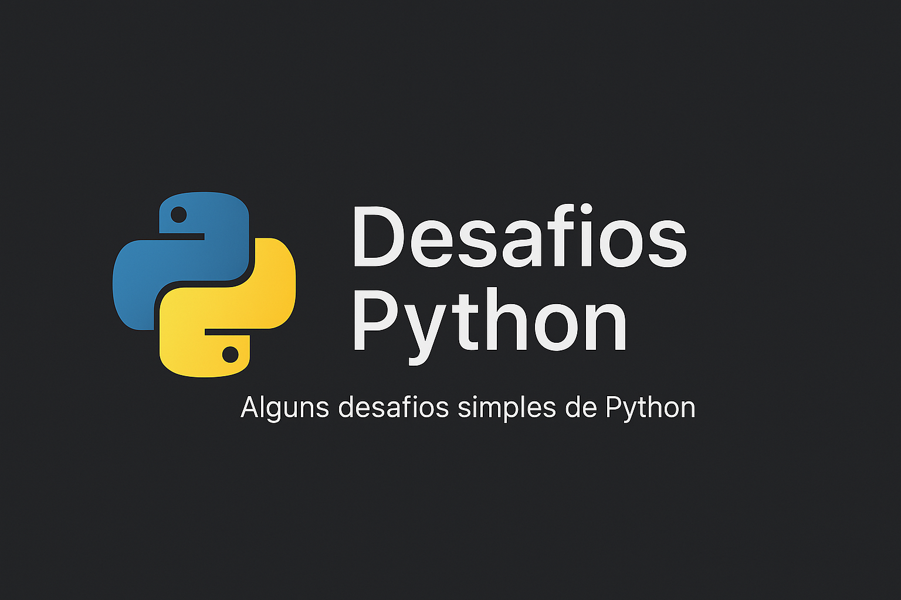

# Desafios Python 🐍

Alguns desafios simples em Python que desenvolvi para praticar lógica de programação e fundamentos da linguagem.



---

## Desafios disponíveis

- 🔢 Adivinhador de Número  
- ➗ Calculadora  
- 🌡️ Conversor de Temperatura  
- 🔐 Gerador de Senha Aleatória 
- 🔮 Jogo da Letra Secreta
- 📝 Lista de Compras
- ▶️ Validador de CPF
- 🆔 Gerador de CPF

---

## Como executar

Clone o repositório:

```bash
git clone https://github.com/heenriquefonseca/desafios-python.git
```

Entre na pasta:

```bash
cd desafios-python
```

Execute qualquer arquivo com:

```bash
python nome_do_arquivo.py
```

---

## Tecnologias usadas

- Python 3.x
- Biblioteca `random`
- Biblioteca `string`
- Biblioteca `os`

---

## Status do projeto
🚧 Em desenvolvimento e prática constante...

---

## Contato

Feito com 💙 por [Henrique Fonseca](https://github.com/heenriquefonseca)  
[LinkedIn](https://www.linkedin.com/in/heenrique-fonseca/)
